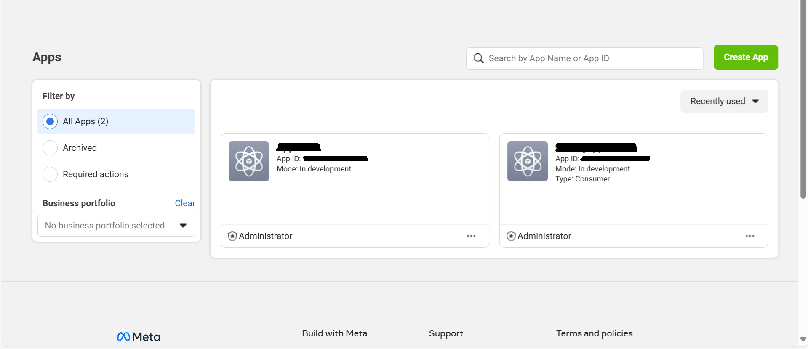
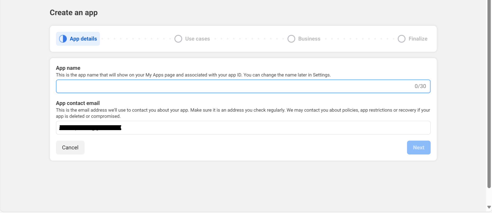
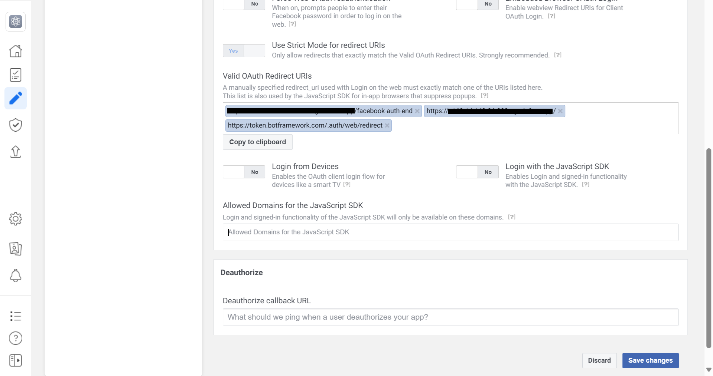

# Create and facebook app.

1. Open [Meta for Developers](https://developers.facebook.com/) and login with your facebook credentials.

2. One the dashboard page go to `My Apps` section.

3. Once the developer page opens, click on `Create App`.

4. Enter `App name`

5. Choose the `Use case` if it aligns with your specific requirement; otherwise, select `Other` and click next.

6. Choose the `app type` if it aligns with your specific requirement; otherwise, select `Consumer` and click next.

7. On the basic information page `App name` will be the name of your app and `App contact email` will be your email linked with facebook, click on Create app.

8. Once the app is created navigate to basic details in App settings section of the app. You will be able to see App ID `FacebookAppId` and App Secret `FacebookAppPassword` which needs to be fill inside appsettings.json file.

9. Now on you app dashboard page, click on `Customize adding a Facebook Login button` and left hand menu click on `Settings`.

10. Scroll in the bottom and find the `Valid OAuth Redirect URIs` add the below valid domains inside the valid domain area. (Note here base-url refers to your app's base url. For eg when using ngrok if our url is `https://1234.ngrok-free.app` then base-url will be `1234.ngrok-free.app`).
`https://<base-url>/`, `https://<base-url>/fb-auth`, `https://token.botframework.com/.auth/web/redirect` and click on save changes.

