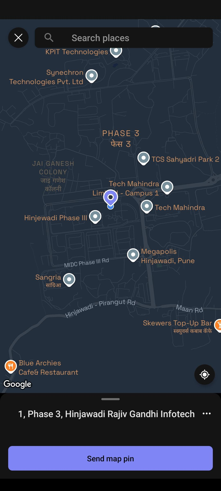
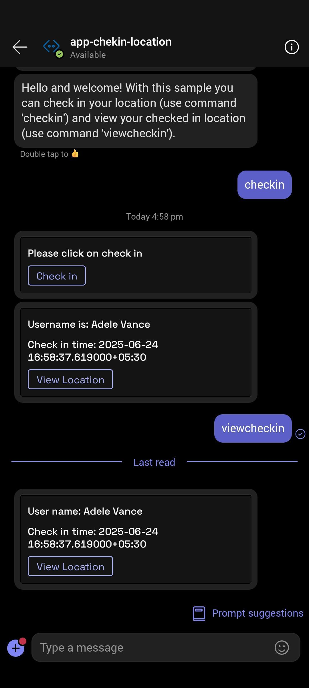

# Get Check-in info of user (Python)

The App Check-In Location sample demonstrates a feature that allows users to check in from their current location and view all previous check-ins using a bot built with Python. This functionality is particularly beneficial for tracking attendance and user engagement within the Microsoft Teams environment.

> **Note:** Microsoft Teams support for geolocation capability is only available for mobile clients.

## Included Features
* Bots
* Adaptive Cards
* Task Modules
* Device Permission API (Location)

## Interaction with app


## Try it yourself - experience the App in your Microsoft Teams client

Please find below demo manifest which is deployed on Microsoft Azure and you can try it yourself by uploading the app package (.zip file link below) to your Teams and/or as a personal app. (Uploading must be enabled for your tenant, [see steps here](https://docs.microsoft.com/microsoftteams/platform/concepts/build-and-test/prepare-your-o365-tenant#enable-custom-teams-apps-and-turn-on-custom-app-uploading)).

**App check-in location:** [Manifest](/samples/app-checkin-location/python/demo-manifest/App-checkin-location.zip)

## Prerequisites

- Microsoft Teams is installed and you have an account (not a guest account)
- [Python SDK](https://www.python.org/downloads/) min version 3.8
- [dev tunnel](https://learn.microsoft.com/en-us/azure/developer/dev-tunnels/get-started?tabs=windows) or [ngrok](https://ngrok.com/) latest version or equivalent tunneling solution
- [Microsoft 365 Agents Toolkit for VS Code](https://marketplace.visualstudio.com/items?itemName=TeamsDevApp.ms-teams-vscode-extension) or [TeamsFx CLI](https://learn.microsoft.com/microsoftteams/platform/toolkit/teamsfx-cli?pivots=version-one)

## Run the app (Using Microsoft 365 Agents Toolkit for Visual Studio Code)

The simplest way to run this sample in Teams is to use Microsoft 365 Agents Toolkit for Visual Studio Code.

1. Ensure you have downloaded and installed [Visual Studio Code](https://code.visualstudio.com/docs/setup/setup-overview)
1. Install the [Microsoft 365 Agents Toolkit extension](https://marketplace.visualstudio.com/items?itemName=TeamsDevApp.ms-teams-vscode-extension) and [Python Extension](https://marketplace.visualstudio.com/items?itemName=ms-python.python)
1. Select **File > Open Folder** in VS Code and choose this samples directory from the repo
1. Press **CTRL+Shift+P** to open the command box and enter **Python: Create Environment** to create and activate your desired virtual environment. Remember to select `requirements.txt` as dependencies to install when creating the virtual environment.
1. Using the extension, sign in with your Microsoft 365 account where you have permissions to upload custom apps
1. Select **Debug > Start Debugging** or **F5** to run the app in a Teams web client.
1. In the browser that launches, select the **Add** button to install the app to Teams.

> If you do not have permission to upload custom apps (uploading), Microsoft 365 Agents Toolkit will recommend creating and using a Microsoft 365 Developer Program account - a free program to get your own dev environment sandbox that includes Teams.

## Setup for bot

> Note these instructions are for running the sample on your local machine, the tunneling solution is required because the Teams service needs to call into the bot.

1. In Azure portal, create Microsoft Entra ID app registration and it will generate MicrosoftAppId and MicrosoftAppPassword for you.
2. In Azure portal, create a [Azure Bot resource](https://docs.microsoft.com/azure/bot-service/bot-builder-authentication?view=azure-bot-service-4.0&tabs=csharp%2Caadv2).
3. Ensure that you've [enabled the Teams Channel](https://docs.microsoft.com/azure/bot-service/channel-connect-teams?view=azure-bot-service-4.0)
    - While registering the bot, use `https://<your_tunnel_domain>/api/messages` as the messaging endpoint.
    - **NOTE:** When you create your app registration in Azure portal, you will create an App ID and App password - make sure you keep these for later.

## Run the app (Manually Uploading to Teams)

### 1. Clone the repository

```bash
git clone https://github.com/OfficeDev/Microsoft-Teams-Samples.git
```

### 2. Run ngrok - point to port 3978

```bash
ngrok http 3978 --host-header="localhost:3978"
```

Alternatively, you can also use the `dev tunnels`. Please follow [Create and host a dev tunnel](https://learn.microsoft.com/en-us/azure/developer/dev-tunnels/get-started?tabs=windows) and host the tunnel with anonymous user access command as shown below:

```bash
devtunnel host -p 3978 --allow-anonymous
```

### 3. In a terminal, navigate to `samples/app-checkin-location/python`

### 4. Activate your desired virtual environment

### 5. Install dependencies

```bash
pip install -r requirements.txt
```

### 6. Update the `config.py` configuration for the bot to use the Microsoft App Id and App Password from the Bot Framework registration, and set the `BaseUrl` with your application base url (e.g., your ngrok url).

### 7. Setup Manifest for Teams

- **This step is specific to Teams.**
    - Edit the `manifest.json` contained in the `appManifest` folder to replace your Microsoft App Id (that was created when you registered your bot earlier) *everywhere* you see the place holder string `${{AAD_APP_CLIENT_ID}}` and `${{TEAMS_APP_ID}}` (depending on the scenario the Microsoft App Id may occur multiple times in the `manifest.json`)
    - Zip up the contents of the `appManifest` folder to create a `manifest.zip`
    - Upload the `manifest.zip` to Teams (in the Apps view click "Upload a custom app")

### 8. Run your bot

```bash
python app.py
```

## Running the sample

**Card with actions check in:**


**Select Geo Location of user:**



**Type Command "viewcheckin":**



**View Location UI:**


## Deploy the bot to Azure

To learn more about deploying a bot to Azure, see [Deploy your bot to Azure](https://aka.ms/azuredeployment) for a complete list of deployment instructions.

## Further reading

- [Bot Framework Documentation](https://docs.botframework.com)
- [Bot Basics](https://docs.microsoft.com/azure/bot-service/bot-builder-basics?view=azure-bot-service-4.0)
- [Azure Bot Service Introduction](https://docs.microsoft.com/azure/bot-service/bot-service-overview-introduction?view=azure-bot-service-4.0)
- [Azure Bot Service Documentation](https://docs.microsoft.com/azure/bot-service/?view=azure-bot-service-4.0)
- [Integrate media Capabilities inside your app](https://learn.microsoft.com/microsoftteams/platform/concepts/device-capabilities/media-capabilities?tabs=mobile)

