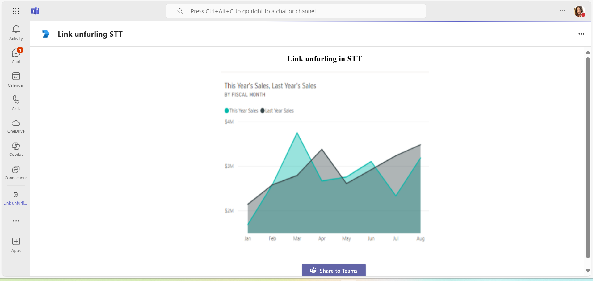
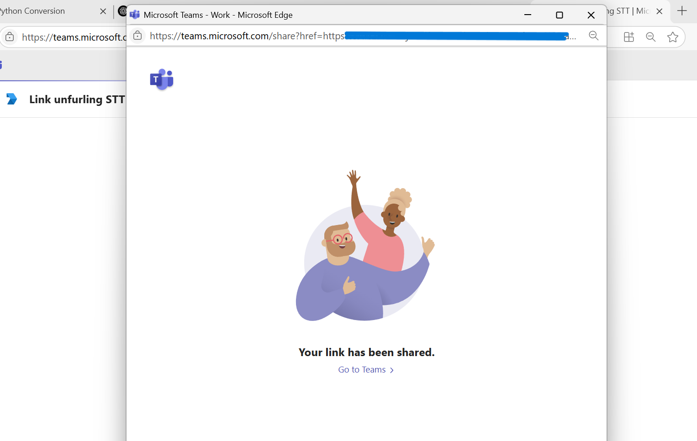
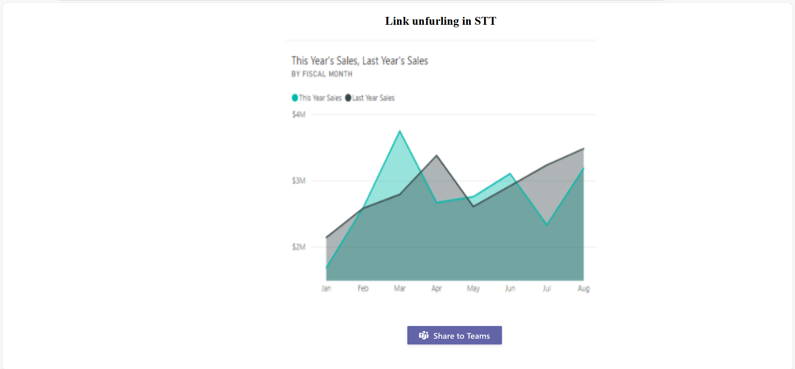

# Link Unfurling in Share to Teams (Python)

This sample demonstrates the Share to Teams feature, allowing users to seamlessly share site content directly to contacts or groups in Microsoft Teams, leveraging link unfurling to provide rich previews and context for shared links. It includes comprehensive setup instructions, bot registration, and local deployment steps for easy integration and testing within your Teams environment using Python.

## Included Features

* Link unfurling in Share to Teams

## Interaction with app


## Try it yourself - experience the App in your Microsoft Teams client

Please find below demo manifest which is deployed on Microsoft Azure and you can try it yourself by uploading the app package (.zip file link below) to your Teams and/or as a personal app. (Sideloading must be enabled for your tenant, [see steps here](https://docs.microsoft.com/microsoftteams/platform/concepts/build-and-test/prepare-your-o365-tenant#enable-custom-teams-apps-and-turn-on-custom-app-uploading)).

**App check-in location:** [Manifest](/samples/app-link-unfurling-in-share-to-teams/python/demo-manifest/app-link-unfurling-stt.zip)

## Prerequisites

1. Office 365 tenant. You can get a free tenant for development use by signing up for the [Office 365 Developer Program](https://developer.microsoft.com/microsoft-365/dev-program).

2. To test locally, [Python](https://www.python.org/downloads/) must be installed on your development machine (version 3.7 or higher).

    ```bash
    python --version
    ```

3. [dev tunnel](https://learn.microsoft.com/en-us/azure/developer/dev-tunnels/get-started?tabs=windows) or [ngrok](https://ngrok.com/) or equivalent tunneling solution.

4. [Microsoft 365 Agents Toolkit for VS Code](https://marketplace.visualstudio.com/items?itemName=TeamsDevApp.ms-teams-vscode-extension) or [TeamsFx CLI](https://learn.microsoft.com/microsoftteams/platform/toolkit/teamsfx-cli?pivots=version-one)

## Run the app (Using Microsoft 365 Agents Toolkit for Visual Studio Code)

The simplest way to run this sample in Teams is to use Microsoft 365 Agents Toolkit for Visual Studio Code.

1. Ensure you have downloaded and installed [Visual Studio Code](https://code.visualstudio.com/docs/setup/setup-overview)
2. Install the [Microsoft 365 Agents Toolkit extension](https://marketplace.visualstudio.com/items?itemName=TeamsDevApp.ms-teams-vscode-extension)
3. Select **File > Open Folder** in VS Code and choose this samples directory from the repo
4. Using the extension, sign in with your Microsoft 365 account where you have permissions to upload custom apps
5. Select **Debug > Start Debugging** or **F5** to run the app in a Teams web client.
6. In the browser that launches, select the **Add** button to install the app to Teams.

> If you do not have permission to upload custom apps (sideloading), Microsoft 365 Agents Toolkit will recommend creating and using a Microsoft 365 Developer Program account - a free program to get your own dev environment sandbox that includes Teams.

## Setup

### 1. Register a new application in Microsoft Entra ID

- Go to [Microsoft Entra ID – App Registrations](https://go.microsoft.com/fwlink/?linkid=2083908) and register a new app.
- Note the Application (client) ID and create a client secret (App password). Save these for later.
- In Azure portal, create a [Azure Bot resource](https://docs.microsoft.com/azure/bot-service/bot-builder-authentication?view=azure-bot-service-4.0&tabs=python).
- Ensure that you've [enabled the Teams Channel](https://docs.microsoft.com/azure/bot-service/channel-connect-teams?view=azure-bot-service-4.0)
- While registering the bot, use `https://<your_tunnel_domain>/api/messages` as the messaging endpoint.

### 2. Setup tunneling

- Run ngrok or dev tunnel to expose your local port 3978:

    ```bash
    ngrok http 3978 --host-header="localhost:3978"
    ```

    Or using dev tunnels:

    ```bash
    devtunnel host -p 3978 --allow-anonymous
    ```

### 3. Setup for code

- In a terminal, navigate to `samples/app-link-unfurling-in-share-to-teams/python`

    ```bash
    cd samples/app-link-unfurling-in-share-to-teams/python
    ```

- (Optional) Create a virtual environment

    ```bash
    python -m venv venv
    ```

- Activate the virtual environment

    - On Windows:
        ```bash
        venv\Scripts\activate
        ```
    - On macOS/Linux:
        ```bash
        source venv/bin/activate
        ```

- Install dependencies

    ```bash
    pip install -r requirements.txt
    ```

- Update the `.env` configuration for the bot to use the `MicrosoftAppId`, `MicrosoftAppPassword`, and `BaseUrl` (your ngrok or dev tunnel URL).

- Run your app

    ```bash
    python app.py
    ```

### 4. Setup Manifest for Teams

- **Edit** the `manifest.json` contained in the ./appManifest folder to replace your Microsoft App Id (that was created when you registered your app registration earlier) *everywhere* you see the place holder string `{{Microsoft-App-Id}}`.
- **Edit** the `manifest.json` for `validDomains` and replace `{{domain-name}}` with the base URL of your domain (e.g., `1234.ngrok-free.app` or `12345.devtunnels.ms`).
- **Zip** up the contents of the `appManifest` folder to create a `manifest.zip` (Make sure that zip file does not contain any subfolder otherwise you will get error while uploading your .zip package).
- Upload the manifest.zip to Teams (in the Apps view click "Upload a custom app").

## Running the sample

  

  
  
  
  
  

  

  

  

## Deploy the bot to Azure

To learn more about deploying a bot to Azure, see [Deploy your bot to Azure](https://aka.ms/azuredeployment) for a complete list of deployment instructions.

## Further reading

- [Bot Framework Documentation](https://docs.botframework.com)
- [Bot Basics](https://docs.microsoft.com/azure/bot-service/bot-builder-basics?view=azure-bot-service-4.0)
- [Share to teams](https://learn.microsoft.com/microsoftteams/platform/concepts/build-and-test/share-to-teams-from-personal-app-or-tab)

