# Bot Sequential Flow Adaptive Cards

Demonstrating on how to implement sequential flow, user specific view and upto date adaptive cards in bot.

## Key features

- Incident Creation
   - Choose Category
   - Choose Sub Category
   - Create Incident
   - Edit/ Approve/ Reject Incident
- List Incidents

## Included Features
* Bots
* Adaptive Cards

## Interaction with app


## Try it yourself - experience the App in your Microsoft Teams client
Please find below demo manifest which is deployed on Microsoft Azure and you can try it yourself by uploading the app package (.zip file link below) to your teams and/or as a personal app. (Sideloading must be enabled for your tenant, [see steps here](https://docs.microsoft.com/microsoftteams/platform/concepts/build-and-test/prepare-your-o365-tenant#enable-custom-teams-apps-and-turn-on-custom-app-uploading)).

**Sequential workflow adaptive cards:** [Manifest](/samples/bot-sequential-flow-adaptive-cards/csharp/demo-manifest/bot-sequential-flow-adaptive-cards.zip)

This App talks about the Teams Bot User Specific Views and Sequential Workflows in adaptive card with python

This bot has been created using [Bot Framework v4](https://dev.botframework.com), it shows how to create a simple bot that accepts food order using Adaptive Cards V1.4

This is a sample app that provides an experience of managing incidents. This sample makes use of Teams platform capabilities like Universal Bots with below mentioned capabilities.
[User Specific Views](https://docs.microsoft.com/microsoftteams/platform/task-modules-and-cards/cards/universal-actions-for-adaptive-cards/user-specific-views)
[Sequential Workflows](https://docs.microsoft.com/microsoftteams/platform/task-modules-and-cards/cards/universal-actions-for-adaptive-cards/sequential-workflows)
[Up to date cards](https://docs.microsoft.com/microsoftteams/platform/task-modules-and-cards/cards/universal-actions-for-adaptive-cards/up-to-date-views)

## Prerequisites

- Microsoft Teams is installed and you have an account
- [Python SDK](https://www.python.org/downloads/) min version 3.6
- [dev tunnel](https://learn.microsoft.com/en-us/azure/developer/dev-tunnels/get-started?tabs=windows) or [ngrok](https://ngrok.com/) latest version or equivalent tunnelling solution

## Run the app (Using Microsoft 365 Agents Toolkit for Visual Studio Code)

The simplest way to run this sample in Teams is to use Microsoft 365 Agents Toolkit for Visual Studio Code.

1. Ensure you have downloaded and installed [Visual Studio Code](https://code.visualstudio.com/docs/setup/setup-overview)
1. Install the [Microsoft 365 Agents Toolkit extension](https://marketplace.visualstudio.com/items?itemName=TeamsDevApp.ms-teams-vscode-extension) and [Python Extension](https://marketplace.visualstudio.com/items?itemName=ms-python.python)
1. Select **File > Open Folder** in VS Code and choose this samples directory from the repo
1. Press **CTRL+Shift+P** to open the command box and enter **Python: Create Environment** to create and activate your desired virtual environment. Remember to select `requirements.txt` as dependencies to install when creating the virtual environment.
1. Using the extension, sign in with your Microsoft 365 account where you have permissions to upload custom apps
1. Select **Debug > Start Debugging** or **F5** to run the app in a Teams web client.
1. In the browser that launches, select the **Add** button to install the app to Teams.

> If you do not have permission to upload custom apps (sideloading), Microsoft 365 Agents Toolkit will recommend creating and using a Microsoft 365 Developer Program account - a free program to get your own dev environment sandbox that includes Teams.

## Run the app (Manually Uploading to Teams)

> Note these instructions are for running the sample on your local machine, the tunnelling solution is required because
the Teams service needs to call into the bot.

1) Clone the repository

    ```bash
    git clone https://github.com/OfficeDev/Microsoft-Teams-Samples.git
    ```

2) Run ngrok - point to port 3978

   ```bash
   ngrok http 3978 --host-header="localhost:3978"
   ```  

   Alternatively, you can also use the `dev tunnels`. Please follow [Create and host a dev tunnel](https://learn.microsoft.com/en-us/azure/developer/dev-tunnels/get-started?tabs=windows) and host the tunnel with anonymous user access command as shown below:

   ```bash
   devtunnel host -p 3978 --allow-anonymous
   ```

3) Create [Azure Bot resource resource](https://docs.microsoft.com/azure/bot-service/bot-service-quickstart-registration) in Azure
    - Use the current `https` URL you were given by running the tunneling application. Append with the path `/api/messages` used by this sample
    - Ensure that you've [enabled the Teams Channel](https://docs.microsoft.com/azure/bot-service/channel-connect-teams?view=azure-bot-service-4.0)
    - __*If you don't have an Azure account*__ you can use this [Azure free account here](https://azure.microsoft.com/free/)

4) In a terminal, go to `samples\bot-sequential-flow-adaptive-cards/python`

5) Activate your desired virtual environment

6) Install dependencies by running ```pip install -r requirements.txt``` in the project folder.

7) Update the `config.py` configuration for the bot to use the Microsoft App Id and App Password from the Bot Framework registration. (Note the App Password is referred to as the "client secret" in the azure portal and you can always create a new client secret anytime.)

8) __*This step is specific to Teams.*__
    - **Edit** the `manifest.json` contained in the `appManifest` folder to replace your Microsoft App Id (that was created when you registered your bot earlier) *everywhere* you see the place holder string `${{AAD_APP_CLIENT_ID}}` and `${{TEAMS_APP_ID}}` (depending on the scenario the Microsoft App Id may occur multiple times in the `manifest.json`)
    - **Zip** up the contents of the `appManifest` folder to create a `manifest.zip`
    - **Upload** the `manifest.zip` to Teams (in the Apps view click "Upload a custom app")

- Upload the manifest.zip to Teams (in the Apps view click "Upload a custom app")
   - Go to Microsoft Teams. From the lower left corner, select Apps
   - From the lower left corner, choose Upload a custom App
   - Go to your project directory, the ./appManifest folder, select the zip folder, and choose Open.
   - Select Add in the pop-up dialog box. Your app is uploaded to Teams.

## Workflows
### Workflow for bot interaction

```mermaid
sequenceDiagram
    participant Teams User B    
    participant Teams User A
    participant Teams Client
    Teams User A->>+Teams Client: Enters create incident bot commands
    Sample App->>+Teams Client: loads card with option 
    Teams User A->>+Teams Client: Enters required details and assigns to user B
    Sample App-->>Teams Client: Posts the incidet card with auto-refresh for user A and user B
    Teams Client->>Teams User A: loads incident card with loading indicator 
    Teams Client->>Sample App: Automatically invokes refresh action
    Sample App-->>Teams User A: Responds with Updated AC for the user A
    Teams User B->>Teams Client: User opens the chat
    Teams Client-->>Teams User B: Loads the incident base card
    Teams Client->>Sample App: Automatically invokes refresh action
    Sample App-->>Teams User B: Responds with card for user B with option to approve/reject
```
### Workflow for messaging extension interaction

```mermaid
sequenceDiagram
    participant Teams User B    
    participant Teams User A
    participant Teams Client
    Teams User A->>+Teams Client: Clicks on Incidents ME action in a group chat
    opt App not installed flow
        Teams Client-->>Teams User A: App install dialog
        Teams User A->>Teams Client: Installs app
    end   
    Teams Client->>+Sample App: Launches Task Module
    Sample App-->>-Teams Client: Loads existing incidents created using Bot
    Teams User A->>Teams Client: Selects incident to share in chat
    Teams Client->>Sample App: Invoke action callback composeExtension/submitAction
    Sample App-->>Teams Client: Posts Base card with auto-refresh for user A and user B
    Teams Client->>Teams User A: loads incident card with loading indicator 
    Teams Client->>Sample App: Automatically invokes refresh action
    Sample App-->>Teams User A: Responds with Updated AC for the user A
    Teams User B->>Teams Client: User opens the chat
    Teams Client-->>Teams User B: Loads the incident base card
    Teams Client->>Sample App: Automatically invokes refresh action
    Sample App-->>Teams User B: Responds with card for user B with option to approve/reject
```


9) Run your bot with `python app.py`

## Running the sample

**Install App:**


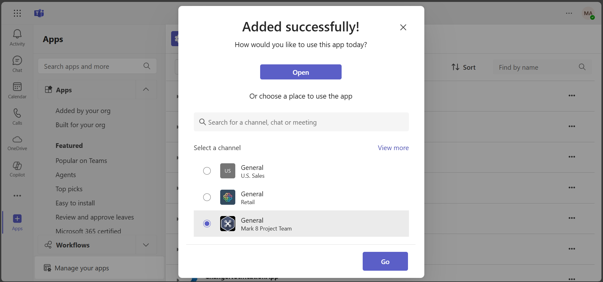

**Welcome UI:**

**Type in Chat: `@Sequential Workflows` (BotName) and Enter**

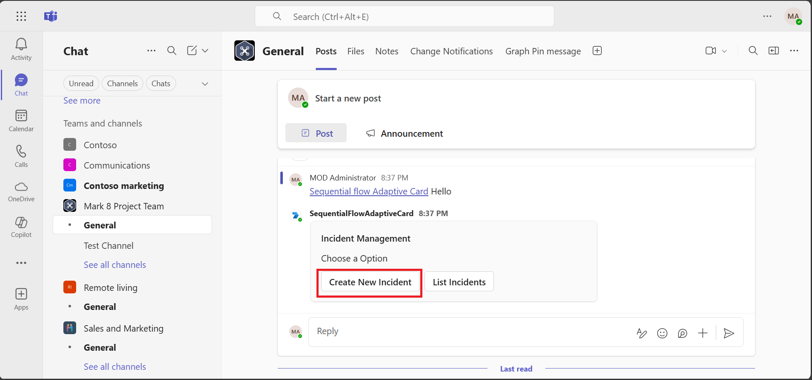

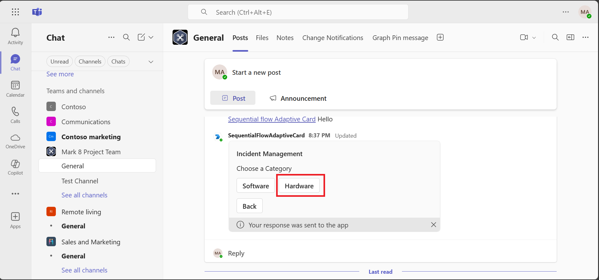

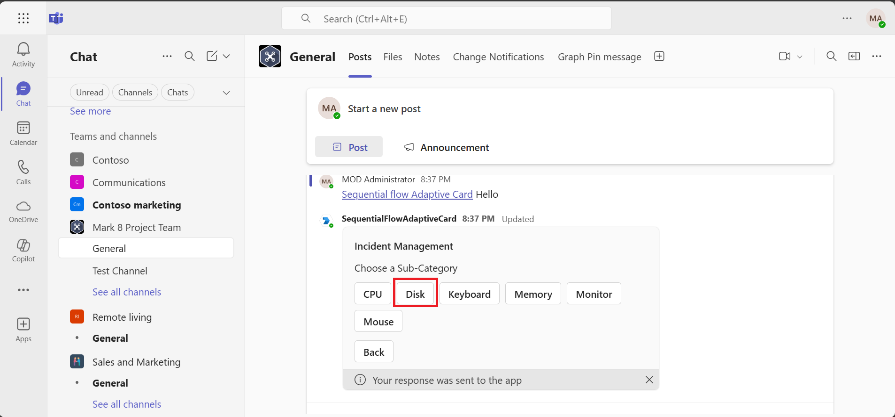

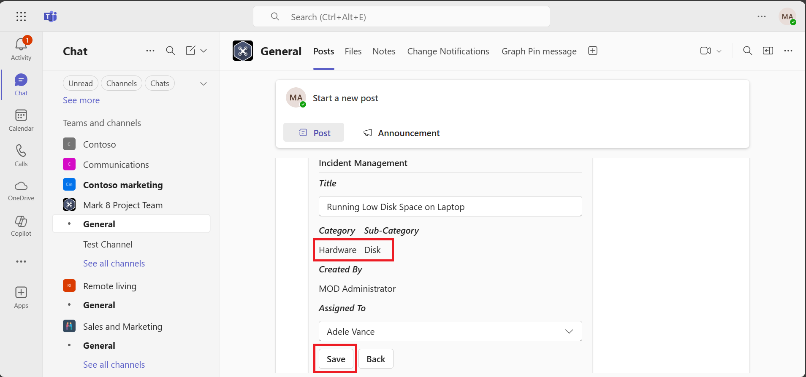

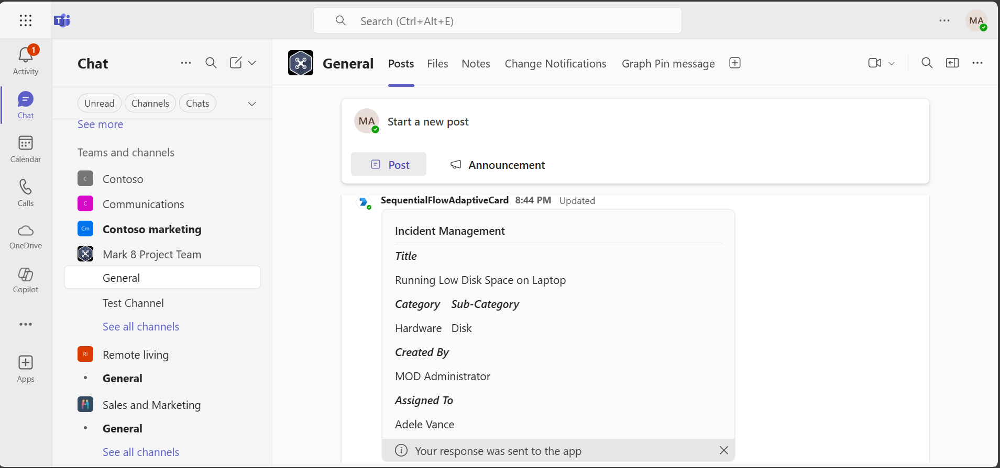

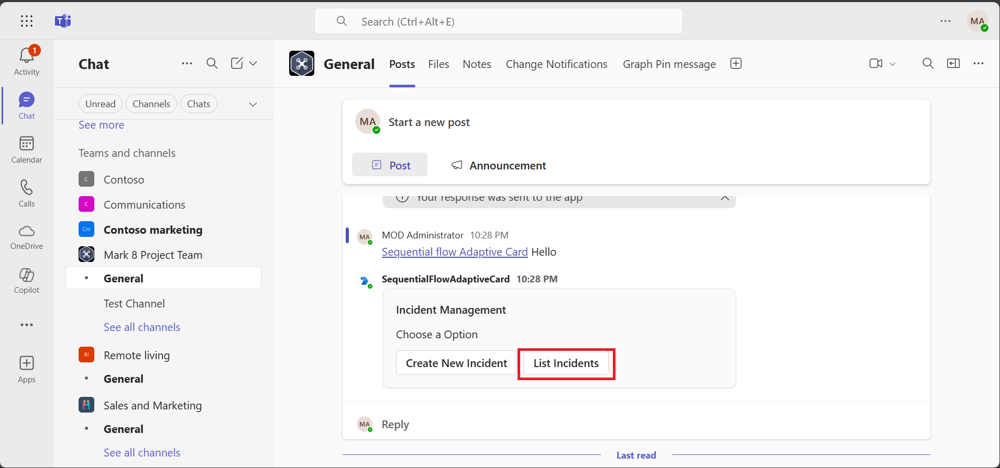

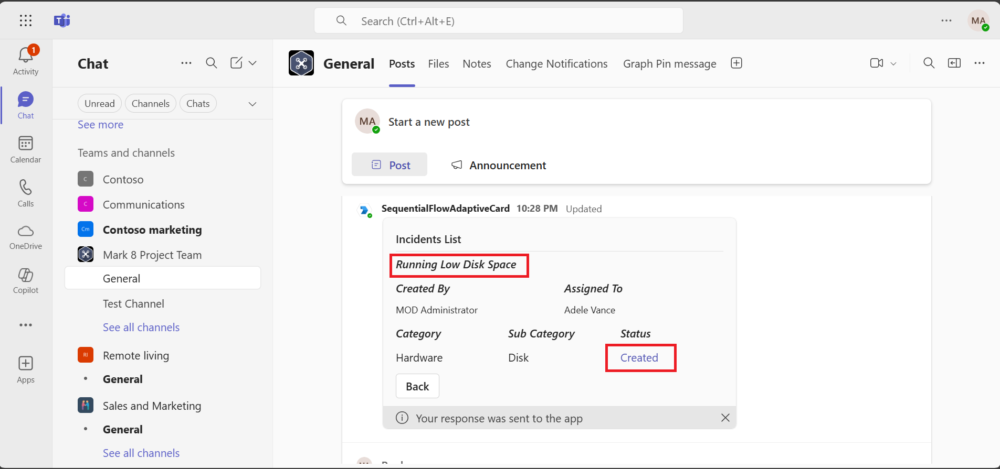


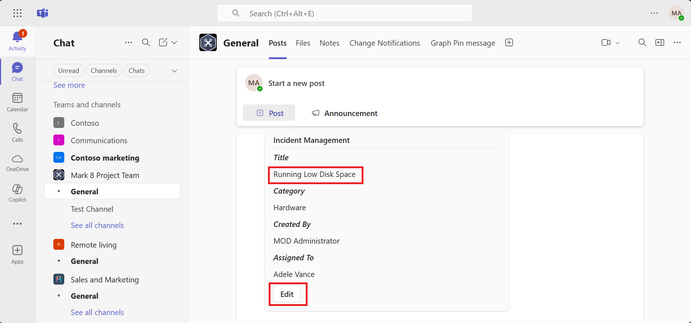

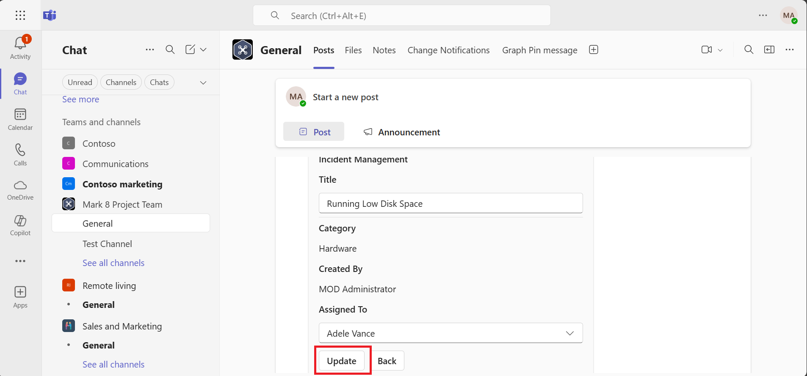

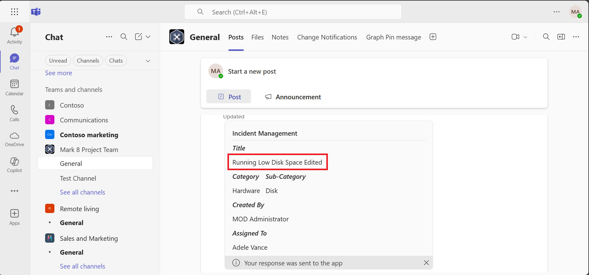

**`Approve` or `Reject` Incidents**

**Only the `Assigned To` person have the option to `Approve` or `Reject`**


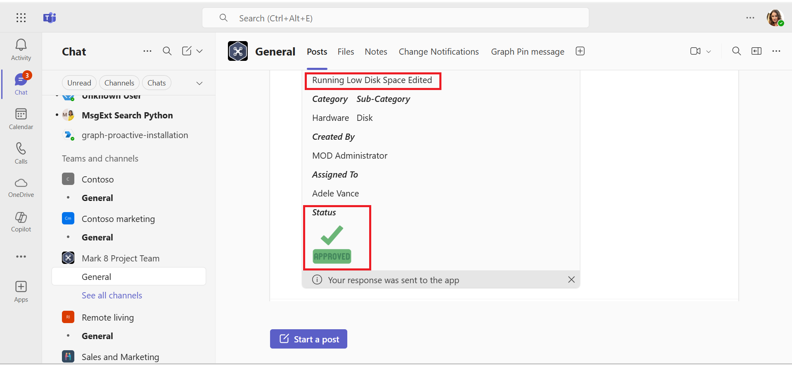


**List Incidents**

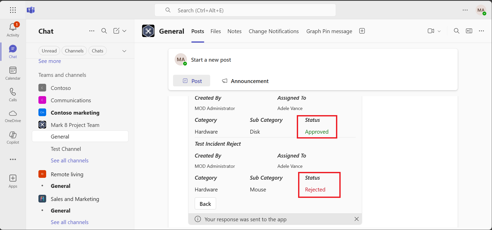

## Interaction from messaging extension.

You can also interact with this app using messaging extension action which allows you to share incidents in group chats.

1. On selecting app from messaging extension,it checks whether bot is installed in chat/team. If not installed, user will get a option for justInTimeInstallation card.

   

2. After successful installation, list of all incident will be available in messaging extension.

   .
   
3. User can select any incident from the list and can share to that chat/team.

   

## Further reading

- [Bot Framework Documentation](https://docs.botframework.com)
- [Bot Basics](https://docs.microsoft.com/azure/bot-service/bot-builder-basics?view=azure-bot-service-4.0)
- [Azure Bot Service Introduction](https://docs.microsoft.com/azure/bot-service/bot-service-overview-introduction?view=azure-bot-service-4.0)
- [Azure Bot Service Documentation](https://docs.microsoft.com/azure/bot-service/?view=azure-bot-service-4.0)
- [User Specific views](https://learn.microsoft.com/en-us/microsoftteams/platform/task-modules-and-cards/cards/universal-actions-for-adaptive-cards/user-specific-views?tabs=mobile%2CC)
- [Bot-Sequential-flow-adaptive-card](https://learn.microsoft.com/power-automate/create-adaptive-cards)

