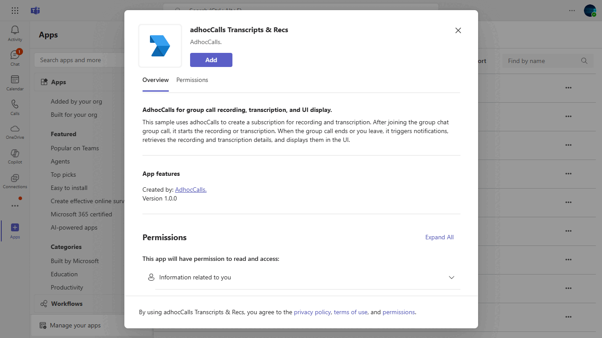
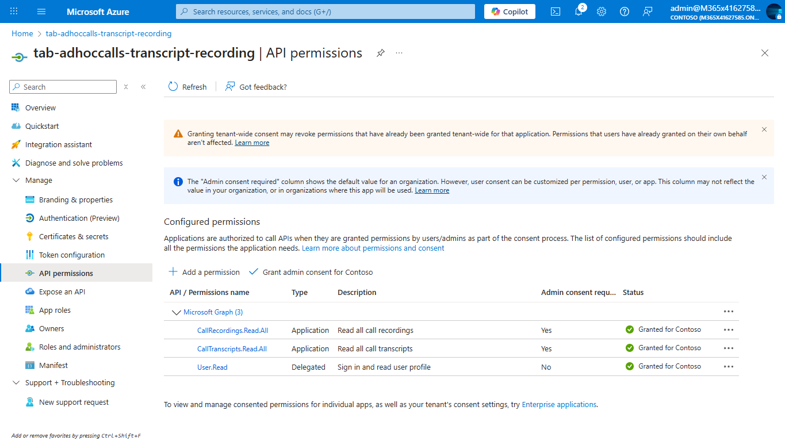
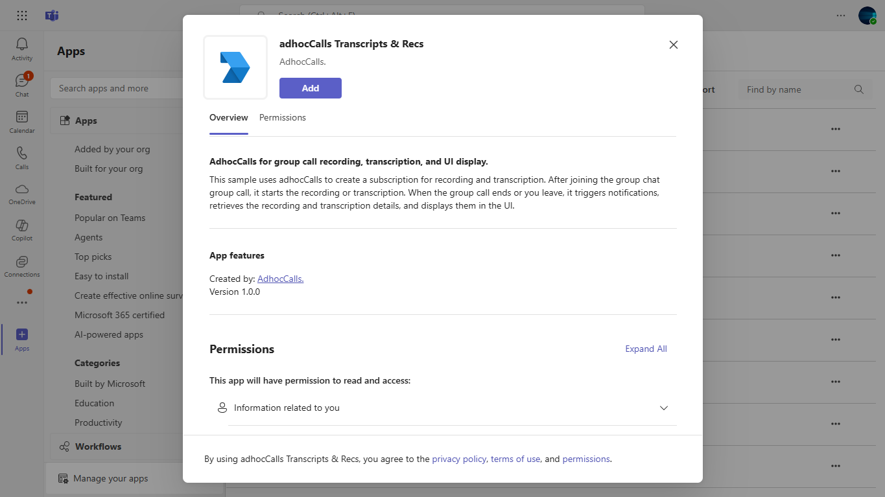
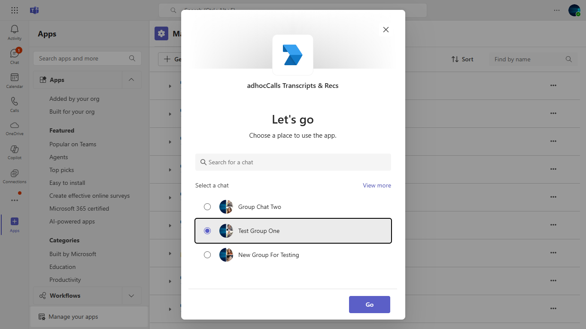
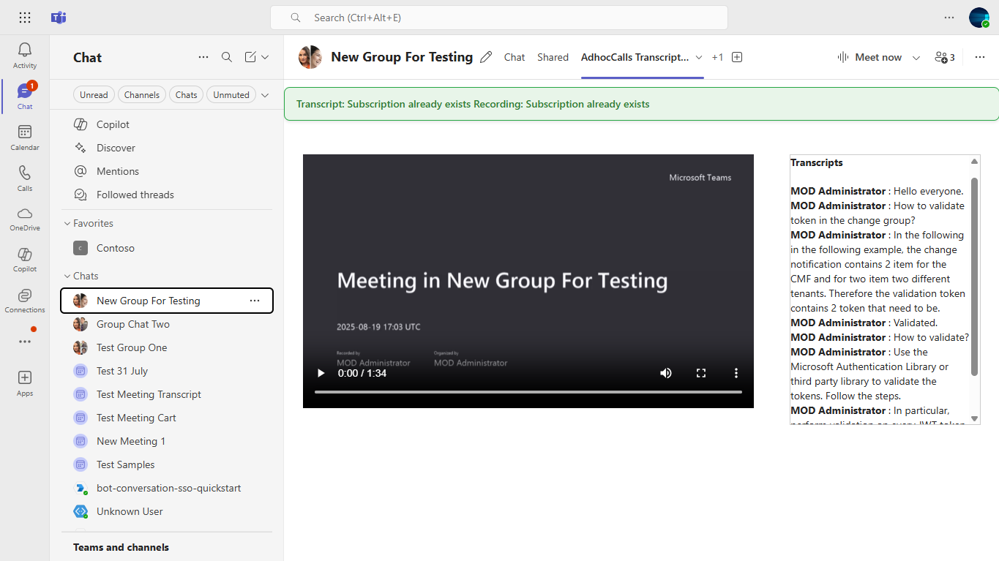

## adhoccalls Transcripts Recordings

This sample uses adhocCalls in Microsoft Teams to create subscriptions for recording and transcription. It initiates recording or transcription after joining a group call in a group chat, monitors call state, triggers notifications on call end, retrieves and processes recording/transcription details, and displays them in the UI.

**Interaction with app**


## Prerequisites

- [NodeJS](https://nodejs.org/en/)
- [dev tunnel](https://learn.microsoft.com/en-us/azure/developer/dev-tunnels/get-started?tabs=windows) or [ngrok](https://ngrok.com/) latest version or equivalent tunnelling solution.
- [Teams](https://teams.microsoft.com) Microsoft Teams is installed and you have an account

### Setup Register you app with Azure AD.

  1. Register a new application in the [Microsoft Entra ID – App Registrations](https://go.microsoft.com/fwlink/?linkid=2083908) portal.
  2. Select **New Registration** and on the *register an application page*, set following values:
      * Set **name** to your app name.
      * Choose the **supported account types** (any account type will work)
      * Leave **Redirect URI** empty.
      * Choose **Register**.
  3. On the overview page, copy and save the **Application (client) ID, Directory (tenant) ID**. You’ll need those later when updating your Teams application manifest and in the `.env` files.
  4. Navigate to **API Permissions**, and make sure to add the follow permissions:
  -   Select Add a permission
  -   Select Microsoft Graph -\> Delegated permissions.

      

  -   Click on Add permissions. Please make sure to grant the admin consent for the required permissions.
  5.  Navigate to the **Certificates & secrets**. In the Client secrets section, click on "+ New client secret". Add a description(Name of the secret) for the secret and select “Never” for Expires. Click "Add". Once the client secret is created, copy its value, it need to be placed in the .env.

## Setup 

> Note these instructions are for running the sample on your local machine.

1. Run ngrok - point to port 3978

   ```bash
   ngrok http 3978 --host-header="localhost:3978"
   ```  

   Alternatively, you can also use the `dev tunnels`. Please follow [Create and host a dev tunnel](https://learn.microsoft.com/en-us/azure/developer/dev-tunnels/get-started?tabs=windows) and host the tunnel with anonymous user access command as shown below:

   ```bash
   devtunnel host -p 3978 --allow-anonymous
   ```

2. Clone the repository

    ```bash
    git clone https://github.com/OfficeDev/Microsoft-Teams-Samples.git
    ```
    
3. We have two different solutions to run, so follow below steps:
 
- In a terminal, navigate to `samples/tab-adhoccalls-transcript-recording/nodejs/api-server` folder, Open your local terminal and run the below command to install node modules. You can do the same in Visual studio code terminal by opening the project in Visual studio code

    ```bash
    npm install
    ```

    ```bash
    npm start
    ```
- The server will start running on 5000 port

- In a different terminal, navigate to `samples/tab-adhoccalls-transcript-recording/nodejs` folder, Open your local terminal and run the below command to install node modules. You can do the same in Visual studio code terminal by opening the project in Visual studio code 

    ```bash
    npm install
    ```

    ```bash
    npm start
    ```
- The client will start running on 3978 port

4. Open .env file from this path folders `samples/tab-adhoccalls-transcript-recording/nodejs` and `samples/tab-adhoccalls-transcript-recording/nodejs/api-server` update:
   - `APP_REGISTRATION_ID` - Generated from Step 1 (Application (client) ID)is the application app ids
   - `CLIENT_SECRET` - Generated from Step 1.14, also referred to as Client secret
   - `BASE_URL` - Your application's base url. E.g. https://12345.ngrok-free.app if you are using ngrok and if you are using dev tunnels, your URL will be like: https://12345.devtunnels.ms.
   - `TENANT_ID` - Generated from Step 1 (Directory (tenant) ID). This is your Azure AD tenant identifier where the app is registered.
   - `USER_ID` - The Object ID of the user who will be using the application. You can find this in Azure AD under Users section.

5. Open .env file from this path folders `samples/tab-adhoccalls-transcript-recording/nodejs` and `samples/tab-adhoccalls-transcript-recording/nodejs/api-server` update:
   - `APP_REGISTRATION_ID` - Generated from Step 1 (Application (client) ID)is the application app ids
   - `BASE_URL` - Your application's base url. E.g. https://12345.ngrok-free.app if you are using ngrok and if you are using dev tunnels, your URL will be like: https://12345.devtunnels.ms.
   
**This step is specific to Teams:**

- **Edit** the `manifest.json` contained in the  `AppManifest` folder to replace your Microsoft App Id `{{Microsoft-App-id}}` (that was created when you registered your bot earlier) *everywhere* you see the place holder string `{{Microsoft-App-id}}` (depending on the scenario the Microsoft App Id may occur multiple times in the `manifest.json`)

- **Edit** the `manifest.json` for `{{domain-name}}` with base Url domain. E.g. if you are using ngrok it would be `https://1234.ngrok-free.app` then your domain-name will be `1234.ngrok-free.app` and if you are using dev tunnels then your domain will be like: `12345.devtunnels.ms`.

- **Zip** up the contents of the `AppManifest` folder to create a `manifest.zip` (Make sure that zip file does not contains any subfolder otherwise you will get error while uploading your .zip package)

- **Upload** the `manifest.zip` to Teams (In Teams Apps/Manage your apps click "Upload an app". Browse to and Open the .zip file. At the next dialog, click the Add button.)

- Add the app to personal static tabs.

## Running the sample

**Step 1 - Install the Application:**
This shows how to install the adhoc calls transcript recording app in Microsoft Teams.


**Step 2 - Select Group Chat:**
Navigate to and select a group chat where you want to enable recording and transcription functionality.


**Step 3 - Welcome Message:**
The app displays a welcome message after successful installation and configuration.


**Step 4 - Recording and Transcript Features:**
View the recording and transcription interface showing available features and controls for managing group call recordings and transcripts.


## Further reading

- [Azure AD application using Microsoft Graph](https://learn.microsoft.com/en-us/graph/tutorial-applications-basics?tabs=http)
- [Receive change notifications through webhooks](https://learn.microsoft.com/en-us/graph/change-notifications-delivery-webhooks?tabs=http)
- [Designing your Microsoft Teams app with basic Fluent UI components](https://learn.microsoft.com/en-us/microsoftteams/platform/concepts/design/design-teams-app-basic-ui-components)


